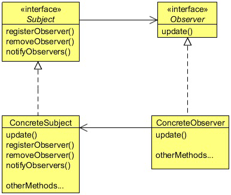

# Observer design pattern

Sports Lobby is a fantastic sports site for sport lovers. They cover almost all kinds of sports and provide the latest news,
information, matches scheduled dates, information about a particular player or a team. Now, they are planning to provide live
commentary or scores of matches as an SMS service, but only for their premium users. Their aim is to SMS the live score, match
situation, and important events after short intervals. As a user, you need to subscribe to the package and when there is a live
match you will get an SMS to the live commentary. The site also provides an option to unsubscribe from the package whenever
you want to.

As a developer, the Sport Lobby asked you to provide this new feature for them. The reporters of the Sport Lobby will sit in
the commentary box in the match, and they will update live commentary to a commentary object. As a developer your job is to
provide the commentary to the registered users by fetching it from the commentary object when it’s available. When there is an
update, the system should update the subscribed users by sending them the SMS.

This situation clearly shows one-to-many mapping between the match and the users, as there could be many users to subscribe to
a single match.

## What is observer pattern

The Observer Pattern is a kind of behavior pattern which is concerned with the assignment of responsibilities between objects.
The behavior patterns characterize complex control flows that are difficult to follow at run-time. They shift your focus away from
the flow of control to let you concentrate just on the way objects are interconnected.

The Observer Pattern defines a one-to-many dependency between objects so that when one object changes state, all its dependents
are notified and updated automatically. The Observer pattern describes these dependencies. The key objects in this pattern are
subject and observer. A subject may have any number of dependent observers. All observers are notified whenever the subject
undergoes a change in its state. In response, each observer will query the subject to synchronize its state with the subject state.

The other way to understand the Observer Pattern is the way Publisher-Subscriber relationship works. Let’s assume for example
that you subscribe to a magazine for your favorite sports or fashion magazine. Whenever a new issue is published, it gets delivered
to you. If you unsubscribe from it when you don’t want the magazine anymore, it will not get delivered to you. But the publisher
continues to work as before, since there are other people who are also subscribed to that particular magazine.

There are four participants in the Observer pattern:
- Subject, which is used to register observers. Objects use this interface to register as observers and also to remove
 themselves from being observers.
 
- Observer, defines an updating interface for objects that should be notified of changes in a subject. All observers 
need to implement the Observer interface. This interface has a method update(), which gets called when the Subject’s 
state changes.

- ConcreteSubject, stores the state of interest to ConcreteObserver objects. It sends a notification to its observers 
when its state changes. A concrete subject always implements the Subject interface. The notifyObservers() method is 
used to update all the current observers whenever the state changes.

- ConcreteObserver, maintains a reference to a ConcreteSubject object and implements the Observer interface. Each 
observer registers with a concrete subject to receive updates.

## When to use the Observer Pattern

Use the Observer pattern in any of the following situations:
- When an abstraction has two aspects, one dependent on the other. Encapsulating these aspects in separate objects 
lets you vary and reuse them independently.
- When a change to one object requires changing others, and you don’t know how many objects need to be changed.
- When an object should be able to notify other objects