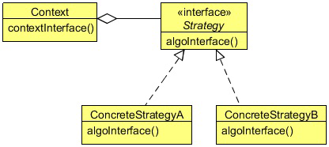

# Strategy design pattern

The Strategy Design Pattern seems to be the simplest of all design patterns, yet it provides great flexibility to your code. This
pattern is used almost everywhere, even in conjunction with the other design patterns. The patterns we have discussed so far have
a relation with this pattern, either directly or indirectly. After this lesson, you will get an idea on how important this pattern is.

To understand the Strategy Design Pattern, let us create a text formatter for a text editor. Everyone should be aware of a text
editor. A text editor can have different text formatters to format text. We can create different text formatters and 
then pass the required one to the text editor, so that the editor will able to format the text as required.

The text editor will hold a reference to a common interface for the text formatter and the editor’s job will be to pass the text to
the formatter in order to format the text.

Let’s implement this using the Strategy Design Pattern which will make the code very flexible and maintainable.

## What is the strategy pattern

The Strategy Design Pattern defines a family of algorithms, encapsulating each one, and making them interchangeable. Strategy
lets the algorithm vary independently from the clients that use it.

The Strategy pattern is useful when there is a set of related algorithms and a client object needs to be able to dynamically pick
and choose an algorithm from this set that suits its current need. The Strategy pattern suggests keeping the implementation of
each of the algorithms in a separate class. Each such algorithm encapsulated in a separate class is referred to as a strategy.
An object that uses a Strategy object is often referred to as a context object.

With different Strategy objects in place, changing the behavior of a Context object is simply a matter of changing its Str
ategy object to the one that implements the required algorithm. To enable a Context object to access different Strategy
objects in a seamless manner, all Strategy objects must be designed to offer the same interface. In the Java programming
language, this can be accomplished by designing each Strategy object either as an implementer of a common interface or as
a subclass of a common abstract class that declares the required common interface.

Once the group of related algorithms is encapsulated in a set of Strategy classes in a class hierarchy, a client can choose from
among these algorithms by selecting and instantiating an appropriate Strategy class. To alter the behavior of the context,
a client object needs to configure the context with the selected strategy instance. This type of arrangement completely
separates the implementation of an algorithm from the context that uses it. As a result, when an existing algorithm implementation
is changed or a new algorithm is added to the group, both the context and the client object (that uses the context)
remain unaffected.

### Strategy
- Declares an interface common to all supported algorithms. Context uses this interface to call the algorithm defined 
by a ConcreteStrategy.

### ConcreteStrategy
- Implements the algorithm using the Strategy interface.

### Context
- Is configured with a ConcreteStrategy object.
- Maintains a reference to a Strategy object.
- May define an interface that lets Strategy access its data.

## When to use the Strategy Design Pattern

Use the Strategy pattern when:
- Many related classes differ only in their behavior. Strategies provide a way to configure a class with one of many 
behaviors.
- You need different variants of an algorithm. For example, you might define algorithms reflecting different 
space/time trade-offs. Strategies can be used when these variants are implemented as a class hierarchy of algorithms.
- An algorithm uses data that clients shouldn’t know about. Use the Strategy pattern to avoid exposing complex, 
algorithm specific data structures.
- A class defines many behaviors, and these appear as multiple conditional statements in its operations. Instead of 
many conditionals, move related conditional branches into their own Strategy class.

## Strategy Pattern in JDK
- java.util.Comparator#compare()
- javax.servlet.http.HttpServlet
- javax.servlet.Filter#doFilter()