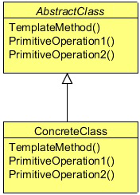

# Template design pattern

The Template Design Pattern is a behavior pattern and, as the name suggests, it provides a template or a structure of an algorithm
which is used by users. A user provides its own implementation without changing the algorithm’s structure.

It is easier to understand this pattern with the help of a problem. We will understand the scenario in this section and will
implement the solution using the Template pattern in a later section.

Have you ever connected to a relation database using your Java application? Let’s recall some important steps which are required
to connect and insert data into the database. First, we need a driver according to the database we want to connect with. Then, we
pass some credentials to the database, then, we prepare a statement, set data into the insert statement and insert it using the insert
command. Later, we close all the connections, and optionally destroy all the connection objects.

You need to write all these steps regardless of any vendor’s relational database. Consider a problem where you need to insert
some data into the different databases. You need to fetch some data from a CSV file and have to insert it into a MySQL database.
Some data comes from a text file and which should be insert into an Oracle database. The only difference is the driver and the
data, the rest of the steps should be the same, as JDBC provides a common set of interfaces to communicate to any vendor’s
specific relation database.

We can create a template, which will perform some steps for the client, and we will leave some steps to let the client to implement
them in its own specific way. Optionally, a client can override the default behavior of some already defined steps.

## What is the Template Design Pattern

The Template Pattern defines the skeleton of an algorithm in an operation, deferring some steps to subclasses. Template Method
lets subclasses to redefine certain steps of an algorithm without changing the algorithm’s structure.

The Template Method pattern can be used in situations when there is an algorithm, some steps of which could be implemented
in multiple different ways. In such scenarios, the Template Method pattern suggests keeping the outline of the algorithm in a
separate method referred to as a template method inside a class, which may be referred to as a template class, leaving out the
specific implementations of the variant portions (steps that can be implemented in multiple different ways) of the algorithm to
different subclasses of this class.

The Template class does not necessarily have to leave the implementation to subclasses in its entirety. Instead, as part of providing
the outline of the algorithm, the Template class can also provide some amount of implementation that can be considered as
invariant across different implementations. It can even provide default implementation for the variant parts, if appropriate. Only
specific details will be implemented inside different subclasses. This type of implementation eliminates the need for duplicate
code, which means a minimum amount of code to be written.

### AbstractClass

- Defines abstract primitive operations that concrete subclasses define to implement steps of an algorithm.
- Implements a template method defining the skeleton of an algorithm. The template method calls primitive operations as
 well as operations defined in AbstractClass or those of other objects. ConcreteClass
- Implements the primitive operations to carry.

## When to use the Template Design Pattern

The Template Method pattern should be used in the following cases:
- To implement the invariant parts of an algorithm once and leave it up to subclasses to implement the behavior that 
can vary.
- When common behavior among subclasses should be factored and localized in a common class to avoid code duplication.
 You first identify the differences in the existing code and then separate the differences into new operations. 
 Finally, you replace the differing code with a template method that calls one of these new operations.
- To control subclasses extensions. You can define a template method that calls "hook" operations (see Consequences) 
at specific points, thereby permitting extensions only at those points.

## Template Pattern in JDK
- java.util.Collections#sort()
- java.io.InputStream#skip()
- java.io.InputStream#read()
- java.util.AbstractList#indexOf()