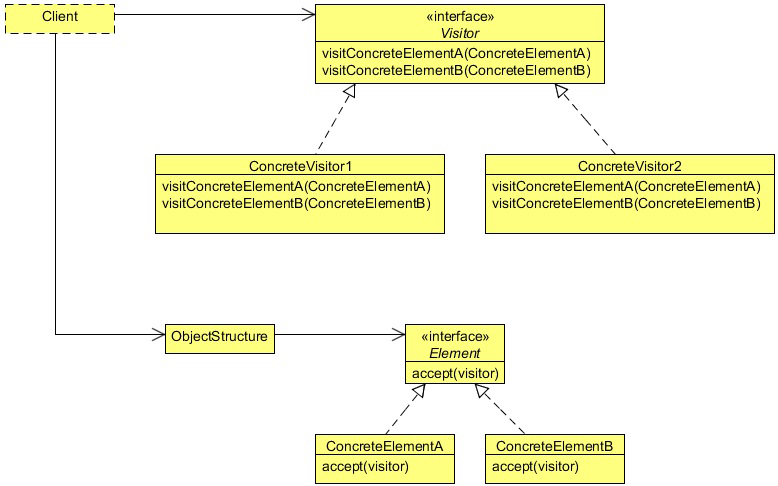

# Visitor design pattern

In the Composite Pattern example, we had created an html structure composed of different types of objects. Now suppose that
we need to add a css class to the html tags. One way to do this is by adding the class when adding a start tag using the
setStartTag method. But this hard coded setting will create inflexibility to our code.

Another way of doing this is by adding a new method like addClass in the parent abstract HtmlTag class. All the child
classes will override this method and will provide the css class. One major drawback of this approach is that, if there are many
child classes (will be in large html page), it will become very expensive and hectic to implement this method in all the child
classes. And suppose, later we need to add another style element in the tags, we again need to do the same thing.

The Visitor Design Pattern provides you with a way to add new operations on the objects without changing the classes of the
elements, especially when the operations change quite often.

## What is the visitor design pattern

The intent of the Visitor Design Pattern is to represent an operation to be performed on the elements of an object structure. Visitor
lets you define a new operation without changing the classes of the elements on which it operates.

The Visitor pattern is useful when designing an operation across a heterogeneous collection of objects of a class hierarchy. The
Visitor pattern allows the operation to be defined without changing the class of any of the objects in the collection. To accomplish
this, the Visitor pattern suggests defining the operation in a separate class referred to as a visitor class. This separates the operation
from the object collection that it operates on. For every new operation to be defined, a new visitor class is created. Since the
operation is to be performed across a set of objects, the visitor needs a way of accessing the public members of these objects.
This requirement can be addressed by implementing the following two design ideas.

### Visitor
- Declares a Visit operation for each class of ConcreteElement in the object structure. The operation’s name and 
signature identifies the class that sends the Visit request to the visitor. That lets the visitor determine the 
concrete class of the element being visited. Then the visitor can access the element directly through its particular 
interface.

### ConcreteVisitor
- Implements each operation declared by Visitor. Each operation implements a fragment of the algorithm defined for the
corresponding class of object in the structure. ConcreteVisitor provides the context for the algorithm and stores its local
state. This state often accumulates results during the traversal of the structure.

### Element
- Defines an Accept operation that takes a visitor as an argument.

### ConcreteElement
- Implements an Accept operation that takes a visitor as an argument.

### ObjectStructure
- Can enumerate its elements.
- May provide a high-level interface to allow the visitor to visit its elements.
- May either be a composite or a collection such as a list or a set.

## When to use the Visitor Design Pattern

Use the Visitor pattern when:
- An object structure contains many classes of objects with differing interfaces, and you want to perform operations 
on these objects that depend on their concrete classes.
- Many distinct and unrelated operations need to be performed on objects in an object structure, and you want to avoid
 "polluting" their classes with these operations. Visitor lets you keep related operations together by defining them 
 in one class. When the object structure is shared by many applications, use Visitor to put operations in just those 
 applications that need them.
- The classes defining the object structure rarely change, but you often want to define new operations over the 
structure. Changing the object structure classes requires redefining the interface to all visitors, which is 
potentially costly. If the object structure classes change often, then it’s probably better to define the operations 
in those classes.

## Visitor Design Pattern in JDK
- javax.lang.model.element.Element and javax.lang.model.element.ElementVisitor
- javax.lang.model.type.TypeMirror and javax.lang.model.type.TypeVisitor