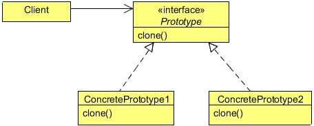

# Prototype Design Pattern

In Object Oriented Programming, you need objects to work with; objects interact with each other to get the job done. But
sometimes, creating a heavy object could become costly, and if your application needs too many of that kind of objects (containing
almost similar properties), it might create some performance issues.

Let us consider a scenario where an application requires some access control. The features of the applications can be used by
the users according to the access rights provided to them. For example, some users have access to the reports generated by the
application, while some don’t. Some of them even can modify the reports, while some can only read it. Some users also have
administrative rights to add or even remove other users.

Every user object has an access control object, which is used to provide or restrict the controls of the application. This access
control object is a bulky, heavy object and its creation is very costly since it requires data to be fetched from some external
resources, like databases or some property files etc.
We also cannot share the same access control object with users of the same level, because the rights can be changed at runtime
by the administrator and a different user with the same level could have a different access control. One user object should have
one access control object.

We can use the Prototype Design Pattern to resolve this problem by creating the access control objects on all levels at once, and
then provide a copy of the object to the user whenever required. In this case, data fetching from the external resources happens
only once. Next time, the access control object is created by copying the existing one. The access control object is not created
from scratch every time the request is sent; this approach will certainly reduce object creation time.

## What is the Prototype Design Pattern

The Prototype design pattern is used to specify the kinds of objects to create using a prototypical instance, and create new objects
by copying this prototype.

The concept is to copy an existing object rather than creating a new instance from scratch, something that may include costly
operations. The existing object acts as a prototype and contains the state of the object. The newly copied object may change
same properties only if required. This approach saves costly resources and time, especially when the object creation is a heavy
process.

In Java, there are certain ways to copy an object in order to create a new one. One way to achieve this is using the Cloneable
interface. Java provides the clone method, which an object inherits from the Object class. You need to implement the
Cloneable interface and override this `clone`method according to your needs.

### Prototype

- Declares an interface for cloning itself

### Concrete Prototype

- Implements an operation for cloning itself

### Client

- Creates a new object by asking a prototype to clone itself.

## When to use the Prototype Design Pattern

- Use the Prototype pattern when a system should be independent of how its products are created, composed, and  
represented; and
- When the classes to instantiate are specified at run-time, for example, by dynamic loading; or
- To avoid building a class hierarchy of factories that parallels the class hierarchy of products; or
- When instances of a class can have one of only a few different combinations of state. It may be more convenient to install a
corresponding number of prototypes and clone them rather than instantiating the class manually, each time with the appropriate
state.
   
   
## Prototype Pattern in JDK

- java.lang.Object#clone()
- java.lang.Cloneable