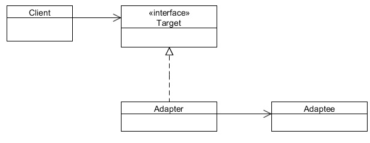

# Adapter design pattern

A software developer, Max, has worked on an e-commerce website. The website allows users to shop and pay online. The site
is integrated with a 3rd party payment gateway, through which users can pay their bills using their credit card. Everything was
going well, until his manager called him for a change in the project.

The manager told him that they are planning to change the payment gateway vendor, and he has to implement that in the
code.

The problem that arises here is that the site is attached to the XPay payment gateway which takes an Xpay type of 
object. The
new vendor, YPay, only allows the YPay type of objects to allow the process. Max does not want to change the whole 
set of 100 of classes which have reference to an object of type XPay. This also raises the risk on the project, which
 is already running on the production. Neither he can change the 3rd party tool of the payment gateway. The problem  
 has occurred due to the incompatible interfaces between the two different parts of the code. In order to get the  
 process work, Max needs to find a way to make the code compatible with the vendor’s provided API.
 
## An adapter to rescue

What Max needs here is an Adapter which can sit in between the code and the vendor’s API, and can allow the process to flow.

But before the solution, let us first see what an adapter is, and how it works. Sometimes, there could be a scenario 
 when two objects don’t fit together, as they should in-order to get the work done. This situation could arise when  
 we are trying to integrate a legacy code with a new code, or when changing a 3rd party API in the code. This is due 
 to incompatible interfaces of the two objects which do not fit together.

The Adapter pattern lets you to adapt what an object or a class exposes to what another object or class expects. It converts
the interface of a class into another interface the client expects. It lets classes work together that could not 
otherwise because of incompatible interfaces. It allows to fix the interface between the objects and the classes 
without modifying the objects and the classes directly.

You can think of an Adapter as a real world adapter which is used to connect two different pieces of equipment that cannot be
connected directly. An adapter sits in-between these equipments, it gets the flow from the equipment and provides it to the other
equipment in the form it wants, which otherwise, is impossible to get due to their incompatible interfaces.

An adapter uses composition to store the object it is supposed to adapt, and when the adapter’s methods are called, it translates
those calls into something the adapted object can understand and passes the calls on to the adapted object. The code that calls the
adapter never needs to know that it’s not dealing with the kind of object it thinks it is, but an adapted object instead.

## When to use Adapter Pattern

The Adapter pattern should be used when:
 - There is an existing class, and its interface does not match the one you need.
 - You want to create a reusable class that cooperates with unrelated or unforeseen classes, that is, classes that  
 don’t necessarily have compatible interfaces.
 - There are several existing subclasses to be use, but it’s impractical to adapt their interface by subclassing every 
 one. An object adapter can adapt the interface of its parent class.