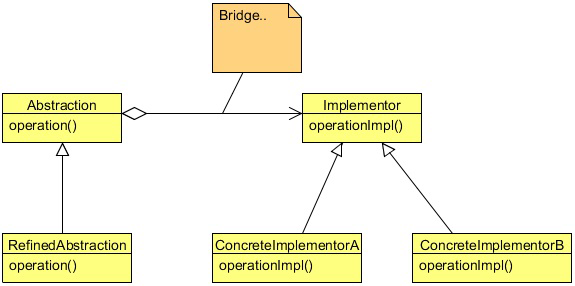

# Bridge design pattern

Sec Security System is a security and electronic company which produces and assembles products for cars. It delivers any car
electronic or security system you want, from air bags to GPS tracking system, reverse parking system etc. Big car companies
use its products in their cars. The company uses a well defined object oriented approach to keep track of their products using
software which is developed and maintained by them only. They get the car, produce the system for it and assemble it into the
car.

Recently, they got new orders from BigWheel (a car company) to produce central locking and gear lock system for 
their new xz model. To maintain this, they are creating a new software system. They started by creating a new 
abstract class CarProductSecurity, in which they kept some car specific methods and some of the features which they 
thought are common to all security products. Then they extended the class and created two different sub classes named
 them BigWheelXZCentralLocking, and BigWheelXZGearLocking.
 
After a while, another car company Motoren asked them to produce a new system of central locking and gear lock for their lm
model. Since, the same security system cannot be used in both models of different cars, the Sec Security System has produced
the new system for them, and also has created to new classes MotorenLMCentralLocking, and MotorenLMGearLocking which
also extend the CarProductSecurity class.

So far so good, but what happens if another car company demands another new system of central locking and gear lock? One
needs to create another two new classes for it. This design will create one class per system, or worse, if the reverse parking
system is produced for each of these two car companies, two more new classes will be created for each of them.

A design with too many subclasses is not flexible and is hard to maintain. An Inheritance also binds an implementation to the
abstraction permanently, which makes it difficult to modify, extend, and reuse the abstraction and implementation independently.
Please note that, the car and the product should vary independently in order to make the software system easy to extend and
reusable.

The Bridge design pattern can resolve this problem.

## What is Bridge Pattern

The Bridge Pattern’s intent is to decouple an abstraction from its implementation so that the two can vary independently. It puts
the abstraction and implementation into two different class hierarchies so that both can be extend independently.

The components of the Bridge Pattern comprise of an abstraction, refined abstraction, an implementer, and concrete implementer.

An abstraction defines the abstraction’s interface and also maintains a reference to an object of type implementer, and the link
between the abstraction and the implementer is called a Bridge.

Refined Abstraction extends the interface defined by the abstraction.

The Implementer provides the interface for implementation classes (concrete implementers).

And the Concrete Implementer implements the Implementer interface and defines its concrete implementation.

The Bridge Pattern decouples the interface and the implementation. As a result, an implementation is not bound permanently to
an interface. The implementation of an abstraction can be configured at run-time. It also eliminates compile-time dependencies
on the implementation. Changing an implementation class doesn’t required recompiling the abstraction class and its clients. The
Client only needs to know about the abstraction and you can hide the implementation from them.

## Use of Bridge Pattern

You should use the Bridge Pattern when:
- You want to avoid a permanent binding between an abstraction and its implementation. This might be the case, for 
example, when the implementation must be selected or switched at run-time.
- Both the abstractions and their implementations should be extensible by sub-classing. In this case, the Bridge  
pattern lets you combine the different abstractions and implementations and extend them independently.
- Changes in the implementation of an abstraction should have no impact on clients; that is, their code should not 
have to be recompiled.
- You want to share an implementation among multiple objects (perhaps using reference counting), and this fact should 
be hidden from the client. 