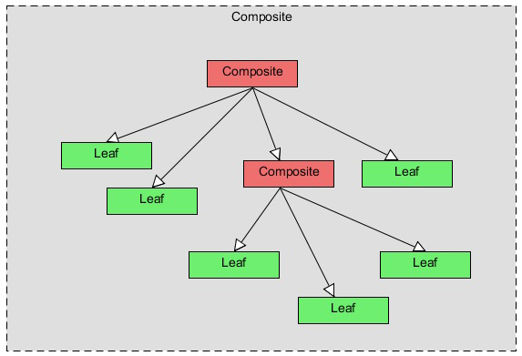
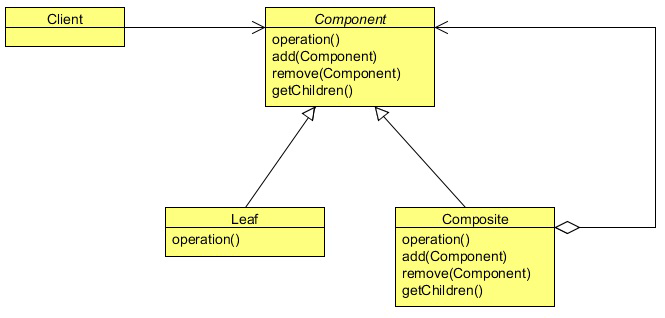

# Composite design pattern

The English meaning of the word Composite is something that is made up of complicated and related parts. The
composite means “putting together” and this is what this design pattern is all about.

There are times when you feel a need of a tree data structure in your code. There are many variations to the tree data structure,
but sometimes there is a need of a tree in which both branches as well as leafs of the tree should be treated as uniformly.

The Composite Pattern allows you to compose objects into a tree structure to represent the part-whole hierarchy which means
you can create a tree of objects that is made of different parts, but that can be treated as a whole one big thing. Composite lets
clients to treat individual objects and compositions of objects uniformly, that’s the intent of the Composite Pattern.

There can be lots of practical examples of the Composite Pattern. A file directory system, an html representation in java, an XML
parser all are well managed composites and all can easily be represented using the Composite Pattern.

## What is the Composite Pattern

The formal definition of the Composite Pattern says that it allows you to compose objects into tree structures to 
represent part-whole hierarchies. Composite lets clients to treat individual objects and compositions of objects 
uniformly.

If you are familiar with a tree data structure, you will know a tree has parents and their children. There can be 
multiple children to a parent, but only one parent per child. In Composite Pattern, elements with children are called
 as Nodes, and elements without children are called as Leafs.

The Composite Pattern allows us to build structures of objects in the form of trees that contains both composition of
 objects and individual objects as nodes. Using a composite structure, we can apply the same operations over both 
 composites and individual objects. In other words, in most cases we can ignore the differences between compositions of objects and individual objects.

The Composite Pattern has four participants:
- Component
- Leaf
- Composite
- Client

The Composite’s role is to define the behavior of the components having children and to store child components. The Composite
also implements the Leaf related operations. These operations may or may not take any sense; it depends on the functionality
implements using the pattern.

A Leaf defines the behavior for the elements in the composition. It does this by implementing the operations the 
Component supports. Leaf also inherits methods, which don’t necessarily make a lot of sense for a leaf node.

The Client manipulates objects in the composition through the Component interface.

## When to use Composite Pattern

- When you want to represent part-whole hierarchies of objects.
- When you want clients to be able to ignore the difference between compositions of objects and individual objects. 
Clients will treat all objects in the composite structure uniformly.