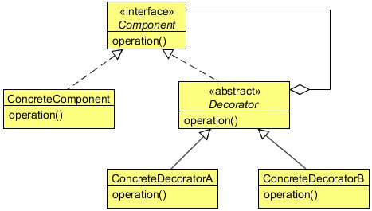

# Decorator design pattern

Let’s help a pizza company make an extra topping calculator. A user can ask to add extra topping to a pizza and our 
job is to add toppings and increase its price using the system.

This is something like adding an extra responsibility to our pizza object at runtime and the Decorator Design Pattern is suitable
for this type of requirement.

## What is the Decorator Design Pattern?

The intent of the Decorator Design Pattern is to attach additional responsibilities to an object dynamically. 
Decorators provide a flexible alternative to sub-classing for extending functionality.

The Decorator Pattern is used to extend the functionality of an object dynamically without having to change the original class
source or using inheritance. This is accomplished by creating an object wrapper referred to as a Decorator around the actual
object.

The Decorator object is designed to have the same interface as the underlying object. This allows a client object to interact
with the Decorator object in exactly the same manner as it would with the underlying actual object. The Decorator object
contains a reference to the actual object. The Decorator object receives all requests (calls) from a client. In turn, it forwards
these calls to the underlying object. The Decorator object adds some additional functionality before or after forwarding
requests to the underlying object. This ensures that the additional functionality can be added to a given object externally at
runtime without modifying its structure.

Decorator prevents the proliferation of subclasses leading to less complexity and confusion. It is easy to add any combination of
capabilities. The same capability can even be added twice. It becomes possible to have different decorator objects for a given
object simultaneously. A client can choose what capabilities it wants by sending messages to an appropriate decorator.

### Component
 - Defines the interface for objects that can have responsibilities added to them dynamically.

### ConcreteComponent
 - Defines an object to which additional responsibilities can be attached.

### Decorator
 - Maintains a reference to a Component object and defines an interface that conforms to Component’s interface.

### ConcreteDecorator
 - Adds responsibilities to the component.
 

## When to use the Decorator Design Pattern?

Use the Decorator pattern in the following cases:
 - To add responsibilities to individual objects dynamically and transparently, that is, without affecting other 
 objects.
 - For responsibilities that can be withdrawn.
 - When extension by sub-classing is impractical. Sometimes a large number of independent extensions are possible and 
  would produce an explosion of subclasses to support every combination. Or a class definition may be hidden or 
  otherwise unavailable for sub-classing.
 

## Decorator Design Pattern in Java
 - java.io.BufferedInputStream(InputStream)
 - java.io.DataInputStream(InputStream)
 - java.io.BufferedOutputStream(OutputStream)
 - java.util.zip.ZipOutputStream(OutputStream)
 - java.util.Collections#checked [List|Map|Set|SortedSet|SortedMap]