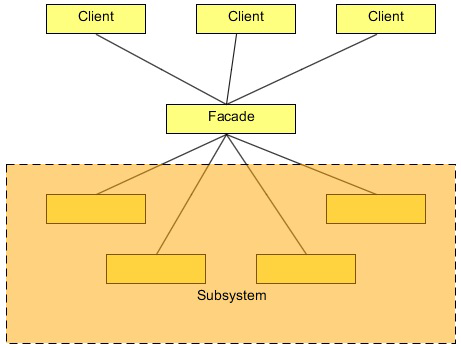

# Facade design pattern

Your company is a product based company and it has launched a product in the market, named Schedule Server. It is a kind
of server in itself, and it is used to manage jobs. The jobs could be any kind of jobs like sending a list of emails, sms, reading
or writing files from a destination, or just simply transferring files from a source to the destination. The product is used by the
developers to manage such kind of jobs and able to concentrate more towards their business goal. The server executes each job
at their specified time and also manages all underline issues like concurrency issue and security by itself. As a developer, one
just need to code only the relevant business requirements and a good amount of API calls is provided to schedule a job according
to their needs.

Everything was going fine, until the clients started complaining about starting and stopping the process of the server. They said,
although the server is working great, the initializing and the shutting down processes are very complex and they want an easy
way to do that. The server has exposed a complex interface to the clients which looks a bit hectic to them.

We need to provide an easy way to start and stop the server.
A complex interface to the client is already considered as a fault in the design of the current system. But fortunately or unfortunately,
we cannot start the designing and the coding from scratch. We need a way to resolve this problem and make the interface
easy to access.

A Facade Pattern can help us to resolve this design problem. But before that, let us see about the Facade Pattern.


## What is the Facade Pattern

The Facade Pattern makes a complex interface easier to use, using a Facade class. The Facade Pattern provides a unified interface
to a set of interface in a subsystem. Facade defines a higher-level interface that makes the subsystem easier to use.

The Facade unifies the complex low-level interfaces of a subsystem in-order to provide a simple way to access that interface. It
just provides a layer to the complex interfaces of the sub-system which makes it easier to use.

The Facade do not encapsulate the subsystem classes or interfaces; it just provides a simplified interface to their functionality. A
client can access these classes directly. It still exposes the full functionality of the system for the clients who may need it.

A Facade is not just only able to simplify an interface, but it also decouples a client from a subsystem. It adheres to the Principle
of Least Knowledge, which avoids tight coupling between the client and the subsystem. This provides flexibility: suppose in the
above problem, the company wants to add some more steps to start or stop the Schedule Server, that have their own different
interfaces. If you coded your client code to the facade rather than the subsystem, your client code doesn’t need to be change, just
the facade required to be changed, that’s would be delivered with a new version to the client.

Clients communicate with the subsystem by sending requests to Facade, which forwards them to the appropriate subsystem
object(s). Although the subsystem objects perform the actual work, the facade may have to do the work of its own to translate its
interface to subsystem interfaces. Clients that use the facade don’t have to access its subsystem objects directly.

Please note that, a Facade same as an Adapter can wrap multiple classes, but a facade is used to an interface to simplify the use
of the complex interface, whereas, an adapter is used to convert the interface to an interface the client expects.




## Solution to the problem

The problem faced by the clients in using the Schedule Server is the complexity brought by the server in order to start and stop
its services. The client wants a simple way to do it. The following is the code that clients required to write to start and stop the
server.
```
ScheduleServer scheduleServer = new ScheduleServer();
```
To start the server, the client needs to create an object of the ScheduleServer class and then need to call the below methods in the
sequence to start and initialize the server.
   ```
   scheduleServer.startBooting();
   scheduleServer.readSystemConfigFile();
   scheduleServer.init();
   scheduleServer.initializeContext();
   scheduleServer.initializeListeners();
   scheduleServer.createSystemObjects();
   System.out.println("Start working......");
   System.out.println("After work done.........");
   ```
To stop the server, the client needs to call the following methods in the same sequence.
   ```
   scheduleServer.releaseProcesses();
   scheduleServer.destory();
   Java Design Patterns 15 / 173
   scheduleServer.destroySystemObjects();
   scheduleServer.destoryListeners();
   scheduleServer.destoryContext();
   scheduleServer.shutdown();
   ```
This looks a burden to them, they are not interested in doing all these stuffs, and why would they? Even though this might look
interesting to some of the clients who might be interested in the low-level interface of the system, most of them disliked it.