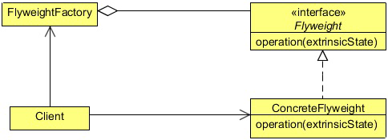

# Flyweight design pattern

Object Oriented programming has made programming easy and interesting. It makes a programmer’s job easier by modeling
real world entities into the programming world. A programmer creates a class and instantiates it by creating an object of it. This
object models a real world entity and objects inside an application coordinate with each other in order to accomplish the required
work.

But sometimes too many objects can slow things down. Too many objects might consume a large piece of memory and can
slow down the application or even cause out of memory problems. As a good programmer, one should keep track of instantiated
objects and control the object creation in an application. This is especially true, when we have a lot of similar objects and two
objects from the pool don’t have much differences between them.

Sometimes the objects in an application might have great similarities and be of a similar kind (a similar kind here means that
most of their properties have similar values and only a few of them vary in value). In case they are also heavy objects to create,
they should be controlled by the application developer. Otherwise, they might consume much of the memory and eventually slow
down the whole application.

The Flyweight Pattern is designed to control such kind of object creation and provides you with a basic caching mechanism. It
allows you to create one object per type (the type here differs by a property of that object), and if you ask for an object with the
same property (already created), it will return you the same object instead of creating a new one.
Before digging into the details of the Flyweight pattern, let’s consider the following scenario: a site which allows users to create
and execute programs online. We will discuss the scenario now and we will later try to solve the problem using the Flyweight
pattern.

The X-programming site allows users to create and execute programs using their favorite programming language. It provides
you with plenty of programming language options. You choose one, write a program with it and execute it to see the result.
But now the site has started losing its users, the reason being the slowness of the site. The users are not interested in it any more.
The site is very popular and sometimes there could be more than thousands of programmers using it. Because of that, the site is
crawling. But the heavy usage is not the real problem behind the slowness of the site. Let us see the core programming of the
site which allows users to run and execute their program, and the true issue will be revealed there.

```java
public class Code {
    private String code;
    
    public String getCode() {
        return code;
    }
    
    public void setCode(String code) {
    this.code = code;
    }
}
```

The above class is used to set the code done by the programmer in order to get it executed. The Code object is a lightweight
simple object having a property code along with its setter and getter.

```java
public interface Platform {
    public void execute(Code code);
}
```

The Platform interface is implemented by the language specific platform in order to execute the code. It has one method,
executes, which takes the Code object as its parameter.

```java
public class JavaPlatform implements Platform {

    public JavaPlatform(){
        System.out.println("JavaPlatform object created");
    }

    @Override
    public void execute(Code code) {
        System.out.println("Compiling and executing Java code.");
    }
}
```

The above class implements the Platform interface and provides an implementation for the execute method, to execute the
code in Java.
To execute the code, a Code object which contains the code and a Platform object to execute the code get created. The code
looks like this:

```
Platform platform = new JavaPlatform();
platform.execute(code);
```

Now suppose, there are around 2k users online and executing their code which results in 2k Code objects and 2k Platform
objects. The Code object is a light weighted object and there should also be one Code object per user code. But, the Platform
is a heavy object which is used to set the execution environment. Creating too many Platform objects is time consuming, and
a heavy task. We need to control the creation of the Platform object which can be done using the Flyweight Pattern


## What is the Flyweight Pattern

The intent of the Flyweight Pattern is to use shared objects to support large numbers of fine-grained objects efficiently. A
flyweight is a shared object that can be used in multiple contexts simultaneously. The flyweight acts as an independent object in
each context - it’s indistinguishable from an instance of the object that’s not shared. Flyweights cannot make assumptions about
the context in which they operate. The key concept here is the distinction between intrinsic and extrinsic state. Intrinsic state is
stored in the flyweight; it consists of information that’s independent of the flyweight’s context, thereby making it sharable. The
extrinsic state depends on and varies with the flyweight’s context and therefore can’t be shared. Client objects are responsible
for passing extrinsic state to the flyweight when it needs it.

Consider an application scenario that involves creating a large number of objects that are unique only in terms of a few parameters.
In other words, these objects contain some intrinsic, invariant data that are common among all objects. This intrinsic data needs
to be created and maintained as part of every object that is being created. The overall creation and maintenance of a large group
of such objects can be very expensive in terms of memory-usage and performance. The Flyweight pattern can be used in such
scenarios to design a more efficient way of creating objects.



### Flyweight
- Declares an interface through which flyweights can receive and act on extrinsic state.

### ConcreteFlyweight
- Implements the Flyweight interface and adds storage for intrinsic state, if any. A ConcreteFlyweight object must be
 sharable.
- Any state it stores must be intrinsic; that is, it must be independent of the ConcreteFlyweight object’s context.

### FlyweightFactory
- Creates and manages flyweight objects.
- Ensures that flyweights are shared properly. When a client requests a flyweight, the FlyweightFactory object supplies an
existing instance or creates one, if none exists.

### Client
- Maintains a reference to flyweight(s).
- Computes or stores the extrinsic state of flyweight(s).


## When to use the Flyweight Pattern

The Flyweight pattern’s effectiveness depends heavily on how and where it’s used. Apply the Flyweight pattern when 
all of the following are true:
- An application uses a large number of objects.
- Storage costs are high because of the sheer quantity of objects.
- Most object state can be made extrinsic.
- Many groups of objects may be replaced by relatively few shared objects once extrinsic state is removed.
- The application doesn’t depend on object identity. Since flyweight objects may be shared, identity tests will 
return true for conceptually distinct objects.